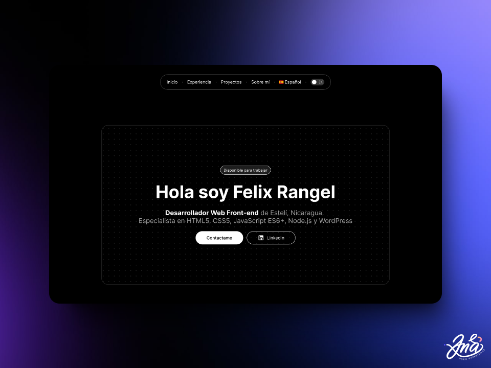

<<<<<<< HEAD
# myportfolio
My personal portfolio
=======


[](https://pagespeed.web.dev/analysis/https-unicorn-sparkle-web-app/cnpanzebex?form_factor=desktop)
[](https://pagespeed.web.dev/analysis/https-unicorn-sparkle-web-app/cnpanzebex?form_factor=desktop)
[](https://pagespeed.web.dev/analysis/https-unicorn-sparkle-web-app/cnpanzebex?form_factor=desktop)
[](https://pagespeed.web.dev/analysis/https-unicorn-sparkle-web-app/cnpanzebex?form_factor=desktop)

# 🦄 Unicorn Sparkle

**Unicorn Sparkle** es la plantilla de portafolio definitiva para desarrolladores que quieren brillar. Combina diseño moderno y funcionalidad mágica para mostrar tus proyectos y habilidades. ¡Destaca con estilo y haz que tu portafolio sea inolvidable!

[](https://www.figma.com/design/RPSa9nHARMmnTemhrGuTCZ/Portafolio-dev?node-id=44-1034&t=dIZVva7mcSSduV6j-1)
[](https://unicorn-sparkle.web.app)

## 👀 Características

- 🚀 Última versión de Astro.
- ✅ ESLint y Prettier configurados.
- 🌐 Túneles listos.
- 🌎 Internacionalización lista (i18n).
- ⚡ Enfoque en el rendimiento.
- ⚙️ Enfoque SEO.
- 🖼️ Procesamiento de imágenes.
- ✨ Compatibilidad con iconos SVG.
- 🪄 Transiciones de vista entre documentos ([referencia](https://developer.chrome.com/docs/web-platform/view-transitions/cross-document)).

> [!NOTE]
> Unicorn Sparkle fue generado con [astro-templates](https://github.com/felixicaza/astro-templates).

## 🤔 ¿Cómo usar?

Para utilizar la plantilla **Unicorn Sparkle** puedes copiar y ejecutar el siguiente comando en tu terminal:

Con NPM:

```bash
npm create astro@latest -- --template UXCorpRangel/portfolios-dev/unicorn-sparkle
```

Con PNPM:

```bash
pnpm create astro@latest -- --template UXCorpRangel/portfolios-dev/unicorn-sparkle
```

Luego entra en la carpeta de tu portafolio, instala las dependencias y ¡listo! 🎉.

## 🛠️ Estructura del proyecto

- [public/favicons/](./public/favicons/): Contiene los archivos de favicon utilizados en la aplicación.

- [public/media/](./public/media/): Almacena archivos de medios como videos que son utilizados en la aplicación.

- [public/og/](./public/og/): Esta carpeta almacena las imágenes Open Graph que son utilizadas para previsualizaciones cuando la página es compartida en redes sociales.

- [src/components/](./src/components/): Contiene los componentes reutilizables que pueden ser usados en diferentes partes de la aplicación.

- [src/data/](./src/data/): Esta carpeta almacena los datos estáticos o archivos que contienen la información que la aplicación necesita.

- [src/icons/](./src/icons/): Incluye los íconos utilizados en la aplicación.

- [src/images/](./src/images/): Contiene todas las imágenes que son utilizadas en la aplicación, ya sean para fondos, gráficos u otros elementos visuales.

- [src/layouts/](./src/layouts/): Almacena los componentes de disposición general de la aplicación, como estructuras de páginas completas para a mantener una consistencia visual en diferentes páginas.

- [src/locales/](./src/locales/): Carpeta destinada a los archivos de localización o internacionalización.

- [src/pages/](./src/pages/): Contiene las secciones principales de cada página de la aplicación. Por ejemplo, [\_home](./src/pages/_home/) contiene las secciones de la página de inicio.

- [src/routes/](./src/routes/): En esta carpeta se gestionan las rutas de la aplicación.

- [src/scripts/](./src/scripts/): Contiene los scripts adicionales necesarios para la funcionalidad del proyecto. Estos scripts pueden incluir utilidades, funciones auxiliares o cualquier lógica que no esté directamente relacionada con la UI.

- [src/styles/](./src/styles/): Almacena los archivos de estilos que definen la apariencia visual de la aplicación. Aquí se definen colores, tipografías, márgenes, entre otros elementos visuales.

## 📦 Dependencias

Descubre las principales integraciones de Astro utilizadas en este proyecto:

- [@astrolicious/i18n](https://www.npmjs.com/package/@astrolicious/i18n): Es una solución de internacionalización para proyectos Astro. Facilita la creación de sitios multilingües, permitiendo gestionar múltiples idiomas y traducir contenido.

- [@playform/compress](https://www.npmjs.com/package/@playform/compress): Es una herramienta que se enfoca en la compresión de activos, como imágenes, scripts y estilos, durante el proceso de construcción.

- [astro-compressor](https://www.npmjs.com/package/astro-compressor): Es una integración que se encarga de comprimir los archivos a Brotli y Gzip durante el proceso de build.

- [astro-icon](https://www.npmjs.com/package/astro-icon): Es una integración que facilita la gestión e inserción de íconos SVG en tu proyecto de Astro.

- [astro-seo-schema](https://www.npmjs.com/package/astro-seo-schema): es una integración que genera automáticamente datos estructurados de esquema ([schema.org](https://schema.org/)) para tu sitio web de Astro.

- [astro-sitemap](https://www.npmjs.com/package/astro-sitemap): Genera automáticamente un sitemap XML para tu sitio web de Astro.

- [astro-tunnel](https://www.npmjs.com/package/astro-tunnel): Permite exponer localmente tu proyecto de Astro a través de una URL pública.

- [sanitize.css](https://www.npmjs.com/package/sanitize.css): Es una hoja de estilos que ofrece un reinicio (reset) y una normalización de los estilos CSS por defecto en los navegadores. Garantiza una apariencia más consistente entre distintos navegadores, eliminando las diferencias en estilos por defecto, lo que permite un desarrollo más predecible y coherente de la UI.

---

Diseñado con ❤️ por [Ana Rangel](https://www.linkedin.com/in/ux-ana-rangel) y desarrollado con 💙 por [Felix Icaza](https://felixicaza.com).
>>>>>>> myportfolio
